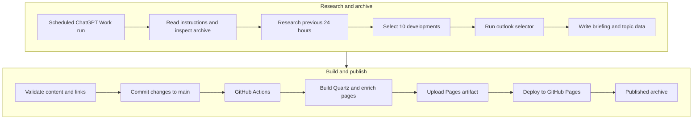

# The Growing News Archive

## TL;DR — 30 seconds

- **What:** An open, automated archive of important international politics, Swiss politics, and technology news.
- **How:** Each day, it selects ten significant developments from the previous 24 hours, summarizes what happened and why it matters, and links to original sources and reusable topic pages.
- **Why:** Topic pages connect coverage across days, building a browsable record of continuing events.
- **Explore:** [Read the live archive](https://mg-automated.github.io/selfgrowing-news/) for daily briefings, topic timelines, search, RSS, and an interactive graph.

Summaries are AI-assisted. Follow the source links to verify details; errors or omissions can occur.

The Growing News Archive is an automated, open Markdown archive of important daily developments in:

- international politics;
- Swiss politics; and
- technology.

The project publishes one daily briefing containing ten substantive developments from the preceding 24 hours. Its purpose is not only to collect news, but to build a connected knowledge archive that becomes more useful over time.

Explore the published archive at [The Growing News Archive](https://mg-automated.github.io/selfgrowing-news/).

## How the archive works

Every day, an automated ChatGPT task:

1. reviews the existing archive to identify stories already covered;
2. researches current reporting from the preceding 24 hours;
3. selects ten developments based on significance rather than popularity;
4. summarizes each development in concise, factual language;
5. explains briefly why the development matters;
6. links the story to relevant reusable topic pages;
7. includes links to the original reporting and primary sources;
8. adds a short overview synthesising the day's selected stories;
9. validates the internal links;
10. reviews only the topic outlooks selected by a cost-aware update process; and
11. commits the completed briefing to this repository.

There is no fixed quota for the three subject areas. The balance depends on the significance of developments during that particular news cycle.

## End-to-end workflow

The archive moves from the scheduled ChatGPT Work run to the published site through the repository's normal GitHub Pages workflow:

The scheduled task is responsible for researching and archiving the news. A successful push to `main` triggers the deployment workflow, which rebuilds the Quartz site from the repository-level Markdown and structured data before publishing the resulting static site.

## Editorial principles

The automated workflow is instructed to:

- prefer substantive developments over speculation, commentary and clickbait;
- use original sources and reputable reporting whenever possible;
- consult multiple sources for major, disputed or politically sensitive stories;
- avoid repeating previously archived stories unless something meaningful has changed;
- clearly distinguish source links from internal topic links;
- never invent facts, quotations, dates or URLs; and
- avoid publishing incomplete or unverified daily briefings.

Story selection inevitably involves judgment. Inclusion in a briefing does not imply endorsement of a source, person, organisation or political position.

## Repository structure

- [`News/Daily/`](News/Daily/) contains the daily briefings.
- [`Topics/`](Topics/) contains reusable pages for countries, organisations, technologies and continuing subjects.
- [`Data/topic-outlooks.json`](Data/topic-outlooks.json) contains structured, reviewable forward-looking assessments used by selected topic pages.
- [`site/`](site/) contains the Quartz configuration used to build the archive as a navigable website.
- [`.github/workflows/deploy-site.yml`](.github/workflows/deploy-site.yml) automatically rebuilds and publishes the website after a new daily briefing is committed.

Daily entries and topic pages use standard Markdown and ISO 8601 timestamps based on the `Europe/Zurich` timezone. The repository remains compatible with Obsidian and other Markdown tools.

## Connected knowledge

Each story links to one or more topic pages. These connections make it possible to follow a subject across multiple days without maintaining a manually curated index.

On the published Quartz site, these relationships can be explored through backlinks, chronological topic timelines and an interactive knowledge graph.

## Explore the published archive

The website adds several ways to explore the Markdown archive:

- an animated graph showing how daily briefings and topics accumulate over time;
- chronological topic timelines containing the relevant excerpts from past briefings;
- backlinks between topic pages and daily stories;
- search, navigation and an RSS feed; and
- selected AI-assisted topic outlooks describing plausible near-term developments, scheduled events and signals that could change the assessment.

Topic outlooks are explicitly probabilistic rather than statements of fact. Each one displays its confidence, review date and validity period, and an expired outlook is marked as awaiting review. To keep the daily workflow efficient, a deterministic selection process maintains a small candidate queue and limits each run to four Outlook-related research subjects, including at most one newly created Outlook. Recurring topics are prioritised, while unsuccessful candidates eventually enter a cooldown instead of being researched repeatedly.

## Sources and verification

Every archived story includes links to the reporting or primary material used to prepare its summary. Readers should follow these links when they need complete context or authoritative information.

This archive is created with automated AI-assisted research and summarization. Although the workflow includes source verification and consistency checks, errors, omissions or outdated information can still occur. The archive should not be treated as a substitute for professional journalism or as legal, financial or other professional advice.

## Corrections

If an entry contains a factual error, broken source link or misleading summary, it should be corrected transparently in the relevant Markdown file. The repository's Git history preserves a record of such changes.

## Technology

The archive combines:

- GitHub for versioning and publication;
- Markdown for portable content;
- Obsidian compatibility for local exploration;
- Quartz and GitHub Pages for the published website; and
- ChatGPT for automated research, summarization, topic linking and repository maintenance.
